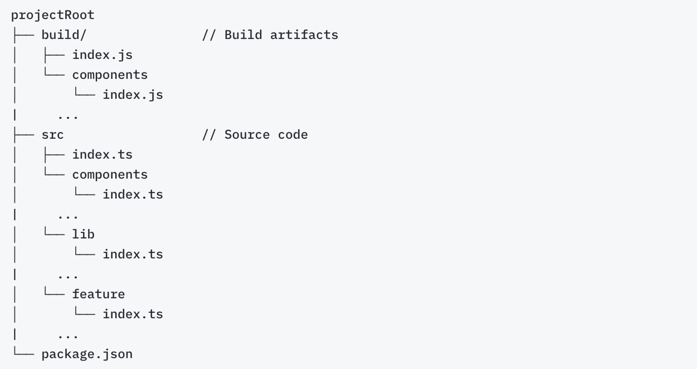

# Exports configuration

> **Note**
>
> Make sure to create the `.omletrc` file in the root directory of your repository before getting started.

The `exports` property tells the CLI about the corresponding entry points of a package in the source code.

If your design system library is used in your application repositories as an external package, define the `exports` property to tell the CLI where the entry points of a package correspond in the source code.

This is similar to the Node.js [package entry point](https://nodejs.org/api/packages.html#exports) configuration (the `exports` and `main` fields of `package.json`). The difference is that, unlike Node.js exports mapping, these patterns should point to the corresponding **source module** for each package export.

> **Tip**
>
> The Omlet CLI follows the same format and convention as Node.js for the exports configuration — except for conditional exports. The main entry point, `import { … } "@acme/design-system"`, is designated with `"."`.

Suppose there's a project with the following structure:



If `package.json` has the entry point defined via the `main` field:

```json
// package.json
{
  "name": "@acme/design-system",
  "main": "build/index.js"
}
```

The following configuration is needed so the CLI can map exported modules and names to their corresponding sources:

```json
// .omletrc
{
  "exports": {
    ".": "src/index.ts"
  }
}
```

If you have a more complex entry-point setup in `package.json` such as:

```json
// package.json
{
  "name": "@acme/design-system",
  "exports": {
    ".": "./build/index.js",
    "./lib": "./build/lib/index.js",
    "./lib/*": "./build/lib/*.js",
    "./lib/*.js": "./build/lib/*.js",
    "./feature": "./build/feature/index.js"
  }
}
```

The corresponding export configuration should look like:

```json
// .omletrc
{
  "exports": {
    ".": "./src/index.ts",
    "./lib": "./src/lib/index.ts",
    "./lib/*": "./src/lib/*.ts",
    "./lib/*.js": "./src/lib/*.ts",
    "./feature": "./src/feature/index.ts"
  }
}
```

If you have a monorepo, define package-specific `exports` configurations using the `workspaces` field:

```json
// .omletrc
{
  "workspaces": {
    "@acme/design-system": {
      "exports": {
        ".": "./src/index.ts"
      }
    }
  }
}
```

---

← [Config file](./README.md) · [Aliases](./aliases.md) →
