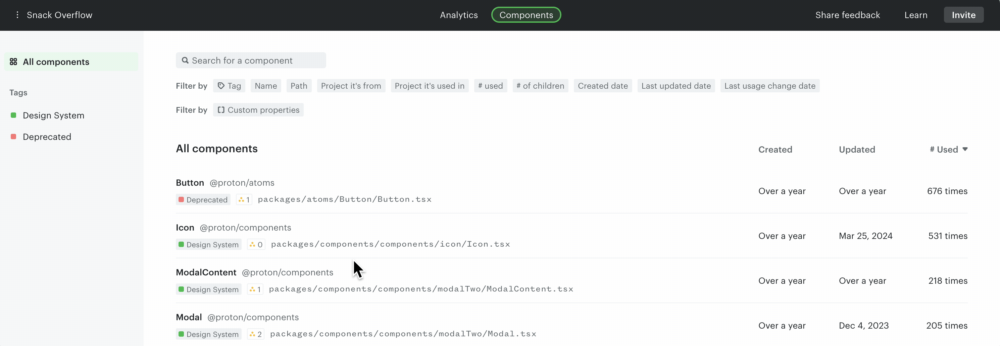
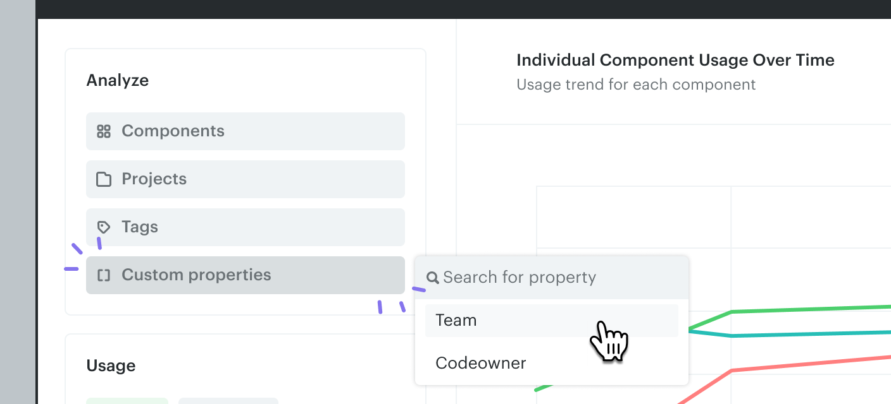

# CLI hooks

CLI hooks let you run custom scripts on scans before the final result is sent to the backend. They give you an interface to process component data and add custom component properties.

## Scanning with a hook script

Place your hook script in any directory. Once the script is ready, scan your repository using the `--hook-script` argument:

```bash
npx @omlet/cli analyze --hook-script ./path/to/hook-script.js
```

```bash
yarn dlx @omlet/cli analyze --hook-script ./path/to/hook-script.js
```

```bash
pnpm dlx @omlet/cli analyze --hook-script ./path/to/hook-script.js
```

### `afterScan` hook

`afterScan` is the only hook supported by Omlet CLI. It runs after a scan completes successfully.

A sample hook script:

```javascript
// hook-script.js
module.exports = {
  async afterScan(components) {
    for (const component of components) {
      component.setMetadata("hasStories", await hasStories(component.filePath));
      component.setMetadata("hasTests", await hasTests(component.filePath));
    }
  },
};
```

> **Tip**
>
> If you have `@omlet/cli` installed as a dependency, the `@type` annotation enables auto-complete and inline documentation for functions and components.

The `setMetadata` function adds properties to components with `string`, `number`, `date`, or `boolean` values, such as:

- `Owner`: the code owner from a `CODEOWNERS` file or any custom source (e.g. `@acme/design-system`, `@acme/backoffice`, `@acme/marketplace`).
- `Has stories`: whether Storybook stories exist for a given component.
- `# of props`: number of props on each component.

Things to know about the `afterScan` hook:

- It can be defined as either an async or a sync function.
- The data passed to the hook is read-only, except for the metadata, which is editable via `setMetadata`.
- You can use npm packages as long as they're available in the Node.js runtime.

### `Component` object properties

Properties of the `Component` object provided by `afterScan`:

| Property           | Type                                            | Description                                                                |
| ------------------ | ----------------------------------------------- | -------------------------------------------------------------------------- |
| `id`               | `String`                                        | Unique identifier for the component.                                       |
| `name`             | `String`                                        | Name of the component as exported in the source code.                      |
| `createdAt`        | `Date`                                          | Creation date of the component, extracted from git history. Optional.      |
| `updatedAt`        | `Date`                                          | Last updated date of the component, extracted from git history. Optional.  |
| `packageName`      | `String`                                        | Package name the component belongs to.                                     |
| `filePath`         | `String`                                        | File path to the component within the repository.                          |
| `props`            | `Array<{ name: String, defaultValue: String }>` | List of props of the component, including name and optional default value. |
| `htmlElementsUsed` | `String[]`                                      | List of HTML elements used within the component.                           |
| `children`         | `Component[]`                                   | Child components detected in the scan.                                     |
| `parents`          | `Component[]`                                   | Parent components detected in the scan.                                    |

## Analyzing custom component properties

Once you have your custom properties on Omlet, create tags based on them to analyze component usage. See [Component tags](../../dashboard/components/tags.md) and [Create custom charts](../../dashboard/analytics/create-custom-charts.md).



For string-based custom properties such as `Team` or `Codeowner`, you can analyze them in charts directly — no need to create individual tags for each value.



## Next up

Tutorials for popular CLI hook use cases:

- [Tutorial: team / code owner usage](./tutorial-team-code-owner.md)
- [Tutorial: package version tracking](./tutorial-package-version.md)
- [Other example scripts](./example-scripts.md)

---

← [Custom component properties](./README.md) · [Tutorial: team/code owner](./tutorial-team-code-owner.md) →
