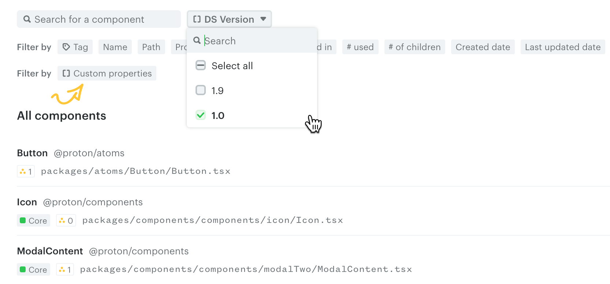
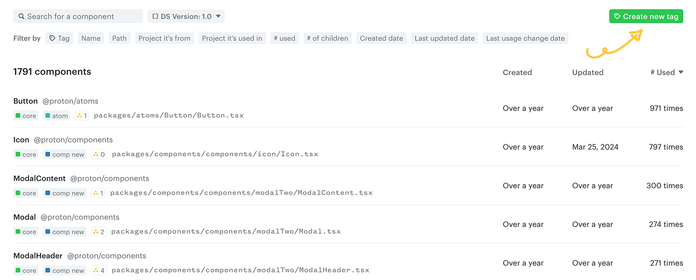
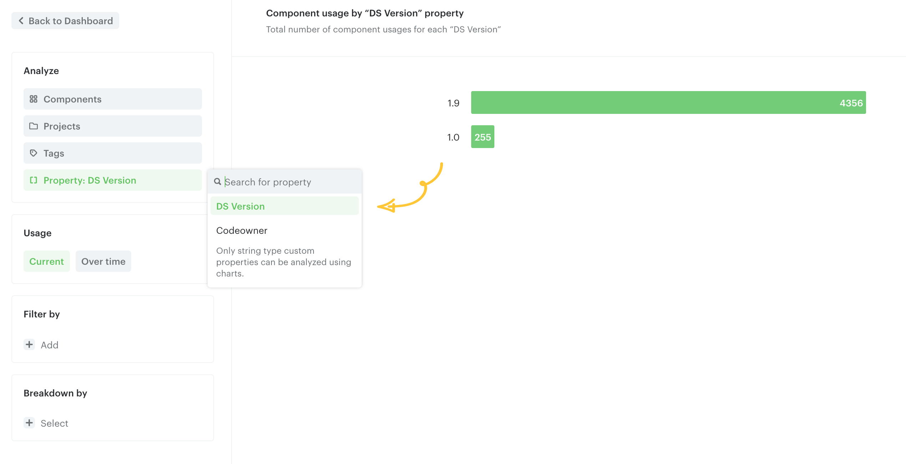
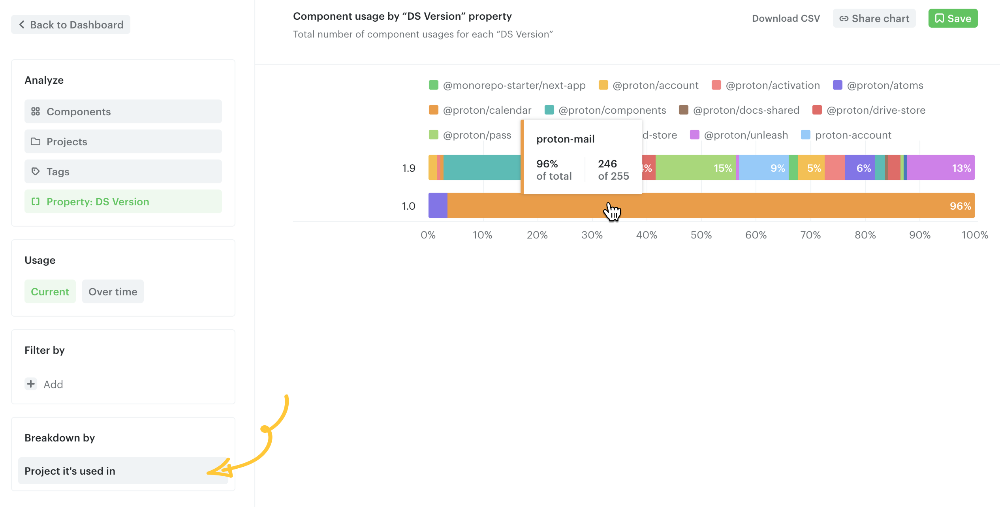

# Tutorial: package version tracking

This tutorial walks you through setting up a custom CLI hook to track the version of your design system package used across your components. Use it to analyze which versions are in use throughout your codebase.

## 1. Install pkg-up

Install [`pkg-up`](https://www.npmjs.com/package/pkg-up) as a dependency. It helps locate the nearest `package.json`:

```bash
npm install pkg-up --save-dev
```

```bash
yarn add pkg-up --dev
```

```bash
pnpm add pkg-up --save-dev
```

## 2. Set up the hook script

Create a file named `hook-script.js` in the root of your application repository. Replace `@design-system` with your actual design system package name:

```javascript
// hook-script.js
const fs = require("fs/promises");
const path = require("path");
const pkgUp = require("pkg-up");

/**
 * Find the closest package.json file and retrieve the design system version.
 *
 * @param {string} filePath - The file path to start the search from.
 * @returns {Promise<string>} - The design system version or 'unknown' if not found.
 */
async function findDSPackageVersion(filePath) {
  try {
    const packageJsonPath = await pkgUp({ cwd: filePath });
    if (!packageJsonPath) return "unknown";

    const packageJson = JSON.parse(await fs.readFile(packageJsonPath, "utf-8"));
    const dependencies = packageJson.dependencies || {};
    const devDependencies = packageJson.devDependencies || {};

    // Replace '@design-system' with your actual design system package name.
    return (
      dependencies["@design-system"] ||
      devDependencies["@design-system"] ||
      "unknown"
    );
  } catch (error) {
    console.error(`Error finding DS version for ${filePath}:`, error);
    return "unknown";
  }
}

/**
 * @type {import('@omlet/cli').CliHookModule}
 */
module.exports = {
  async afterScan(components) {
    const promises = components.map(async (component) => {
      const dsVersion = await findDSPackageVersion(component.filePath);
      component.setMetadata("DS Version", dsVersion);
    });

    await Promise.all(promises);
  },
};
```

`findDSPackageVersion` searches for the nearest `package.json` relative to a given component's file path and reads the version of your design system package.

The `afterScan` hook processes each component and sets the result as the `DS Version` property. Rename the property if you prefer.

## 3. Scan your repo

```bash
npx @omlet/cli analyze --hook-script ./hook-script.js
```

```bash
yarn dlx @omlet/cli analyze --hook-script ./hook-script.js
```

```bash
pnpm dlx @omlet/cli analyze --hook-script ./hook-script.js
```

## 4. Filter components by DS Version

Once the scan completes, the `DS Version` property is associated with each component.

Navigate to the **Components** page. From the **Custom properties** filter, click `DS Version` and select a version from the dropdown to list the matching components.



You can save this filter as a tag for easy access later.



## 5. Analyze the usage

Open your Analytics dashboard and click **Create new analysis** in the top right. Under the **Analyze** section, select **DS Version** from **Custom properties**. The total component usages for each version will be listed.



Break down the chart by **Project it's used in** to see which projects are still using older versions of your design system.



---

← [Tutorial: team/code owner](./tutorial-team-code-owner.md) · [Example scripts](./example-scripts.md) →
