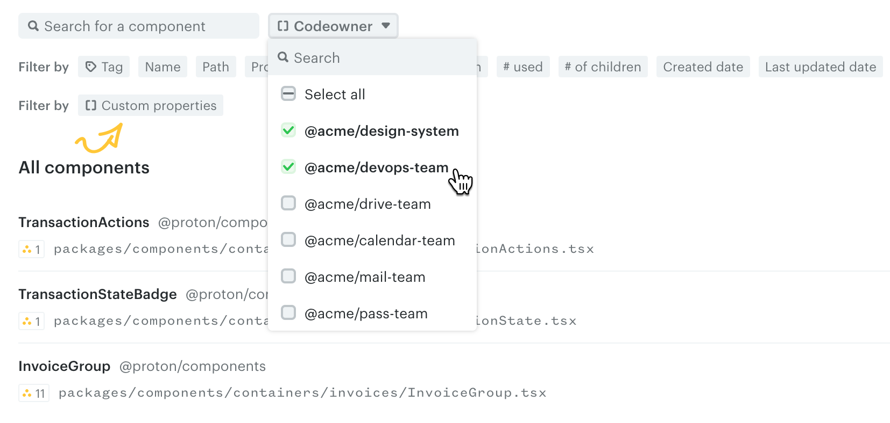
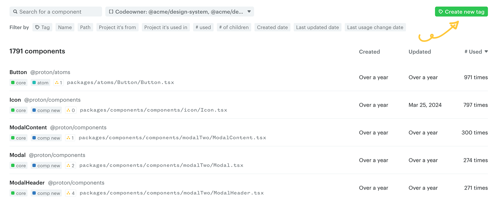
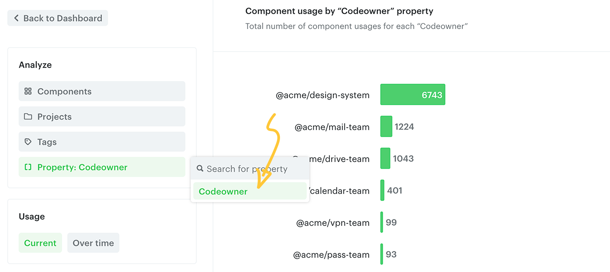
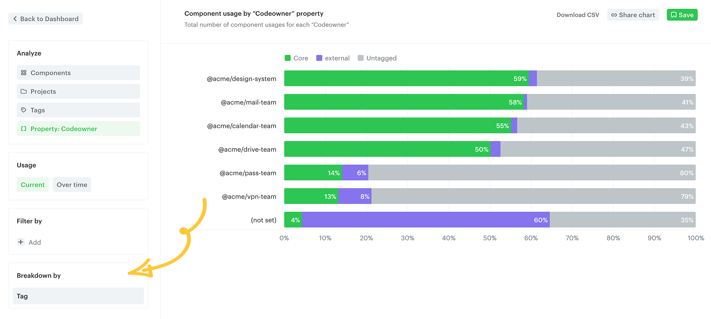

# Tutorial: team / code owner usage

This tutorial walks you through creating a hook script that processes the `CODEOWNERS` file and adds the owner information as a custom property to each component. Use it to analyze design system adoption across teams.

## 1. CODEOWNERS file

`CODEOWNERS` is a file used in many repositories (GitHub, GitLab, Bitbucket) to define the owners of specific files or directories. Example:

```
# .github/CODEOWNERS

# Default owner for all files
* @acme/design-system

# Owners for specific applications
applications/mail/ @acme/mail-team
applications/calendar/ @acme/calendar-team
applications/drive/ @acme/drive-team
applications/vpn-settings/ @acme/vpn-team
applications/pass/ @acme/pass-team

# Owners for shared packages
packages/components/ @acme/frontend-team
packages/utils/ @acme/frontend-team

# Owners for configuration and tooling
.yarn/ @acme/devops-team
.eslintrc.js @acme/devops-team
.prettier.config.mjs @acme/devops-team
```

Make sure the [`codeowners`](https://www.npmjs.com/package/codeowners) package is installed as a dependency in your project — it processes the `CODEOWNERS` file:

```bash
npm install codeowners --save-dev
```

```bash
yarn add codeowners --dev
```

```bash
pnpm add codeowners --save-dev
```

## 2. Set up the hook script

Create a file named `hook-script.js` in the root of your repository:

```javascript
// hook-script.js
const Codeowners = require("codeowners");

const repo = new Codeowners();
function getOwners(filePath) {
  const owners = repo.getOwner(`${filePath}`);
  if (owners.length === 0) {
    owners.push("unknown");
  }
  return owners
    .filter((o) => o !== "")
    .map((o) => `${o}`)
    .join(",");
}

/**
 * @type {import('@omlet/cli').CliHookModule}
 */
module.exports = {
  async afterScan(components) {
    for (const component of components) {
      const owners = getOwners(component.filePath);
      component.setMetadata("Codeowner", owners);
    }
  },
};
```

`setMetadata` adds the `Codeowner` property to each component. Rename the property if you prefer.

## 3. Scan your repo

Use the `--hook-script` argument with the `analyze` command:

```bash
npx @omlet/cli analyze --hook-script ./hook-script.js
```

```bash
yarn dlx @omlet/cli analyze --hook-script ./hook-script.js
```

```bash
pnpm dlx @omlet/cli analyze --hook-script ./hook-script.js
```

## 4. Filter components by owner

Once the scan completes, the `Codeowner` property is associated with each component.

Navigate to the **Components** page. From the **Custom properties** filter, click `Codeowner` and select some owners from the dropdown to list the matching components.



You can save this filter as a tag for easy access later.



## 5. Analyze the usage

Open your Analytics dashboard and click **Create new analysis** in the top right. Under the **Analyze** section, select **Codeowner** from **Custom properties**. The total number of component usages for each codeowner will be listed.



You can break down the chart for deeper insight. For example, adding a **Tag** breakdown lets you compare each team's design system usage to overall component usage.



---

← [CLI hooks](./cli-hooks.md) · [Tutorial: package version](./tutorial-package-version.md) →
