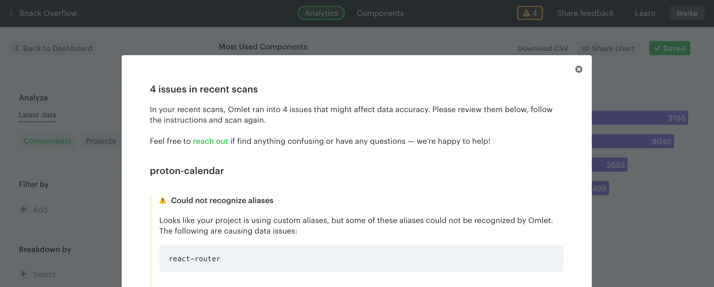

# Ensure data accuracy

After scanning your codebase, you might be informed about possible data issues through the web app.

These issues can cause:

- Duplicate components
- Components incorrectly tagged as `external`
- Inconsistent usage counts

They can happen when:

- Omlet is unable to resolve imports from external packages. For example, if your design system library is consumed by your application repositories as an external dependency, the CLI needs to map imports from the build to their sources correctly.
- Omlet can't resolve your import paths properly because you have aliases configured in `tsconfig` or a bundler like Webpack, Babel, or Vite.

Omlet tries to detect these automatically, but it might not work for your specific setup.

To resolve imports from external packages or map aliases, create an `.omletrc` file in the root of your repository and define the `exports` or `aliases` properties. See:

- [Exports configuration](./config-file/exports.md)
- [Mapping aliases](./config-file/aliases.md)

If you have unnecessary components in your scans (Storybook stories, test files, duplicates from `dist` folders), prevent the CLI from scanning them by defining glob patterns:

- [Excluding components and files](./config-file/excluding-files.md)

You can also follow the config file tutorial with a sample codebase:

- [Tutorial: config file](./config-file/tutorial.md)

---

← [Future scans](./future-scans.md) · [Set up regular scans](./set-up-regular-scans.md) →
