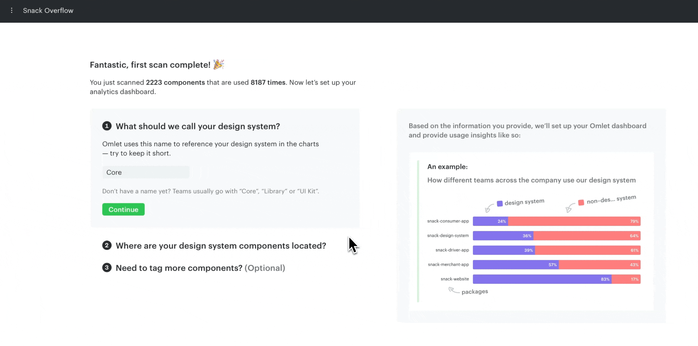

# Set up your dashboard

After the first scan, Omlet takes you through a 3-step process to tag your components in the web app. These tags are used to reference your design system components — and other sets of components — in the analytics dashboard.

## Tag your design system components

First, name a tag that represents your design system components. You can choose any name; common ones are "Core", "Library", or "UI Kit".

Then select which packages or folders contain these components from the packages list on the right.



> **No design system components?**
>
> Make sure the design system's repository has been scanned. From the root of that repo, run:
>
> ```sh
> npx @omlet/cli analyze
> ```
>
> ```sh
> yarn dlx @omlet/cli analyze
> ```
>
> ```sh
> pnpm dlx @omlet/cli analyze
> ```

## Create more tags

You can create more tags to identify other sets of components — for example, legacy components you've deprecated.

This step is optional. You can adjust your tags later.


That's it — Omlet will redirect you to the Analytics page where you can get insights into your components.


---

← [Your first scan](./your-first-scan.md) · [Future scans](./future-scans.md) →
