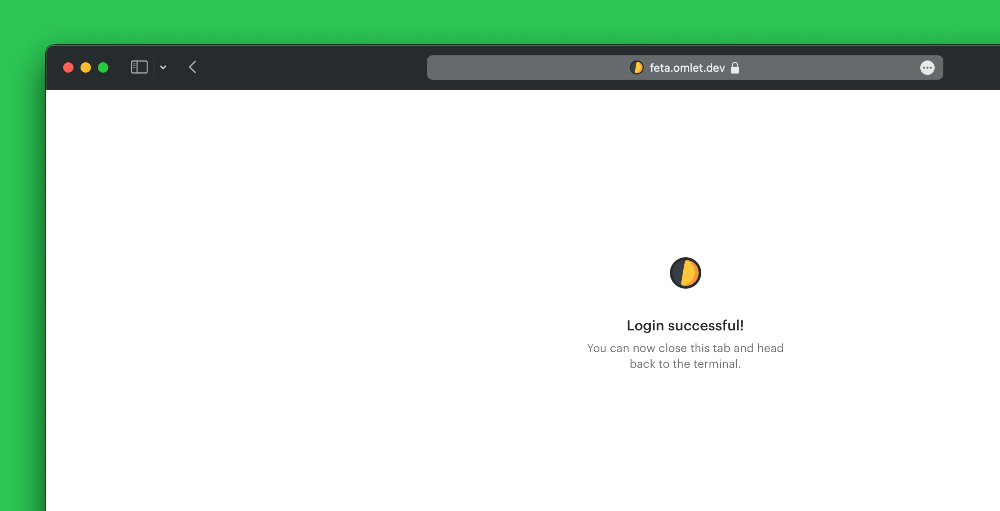
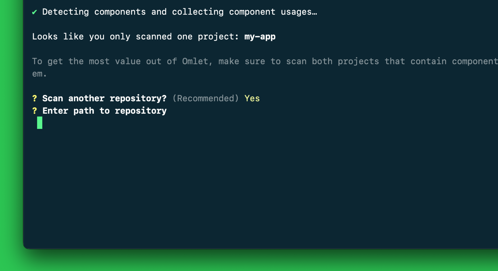
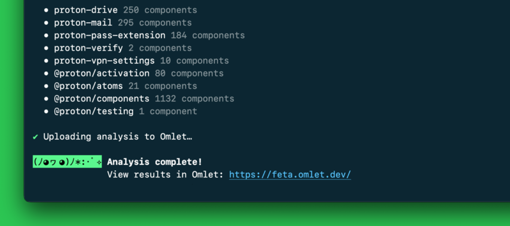

# Your first scan

The first scan goes through the [`init`](./commands/init.md) command, which takes you through a guided process.

> **Tip**
>
> Scan the repository that includes your design system components first.

To start the component analysis, navigate to the root of the repo you wish to scan and run:

```sh
npx @omlet/cli init
```

```sh
yarn dlx @omlet/cli init
```

```sh
pnpm dlx @omlet/cli init
```

This will install the latest version of the CLI and ask you to log in to your Omlet account.



> **Note**
>
> If the CLI doesn't detect the login, you can copy/paste the token manually.

If the repository you scanned includes only a single package, the CLI will prompt you to scan more repositories. Make sure to scan both the design system and the application projects so you can see adoption of your design system across projects.



> **Note**
>
> If multiple packages are already scanned with `init` (such as a monorepo), the CLI will not prompt you to scan more repositories. You can scan them with the [`analyze`](./commands/analyze.md) command later.

After completing the scans, follow the link to set up your analytics dashboard.



---

[Set up your dashboard](./set-up-your-dashboard.md) →
