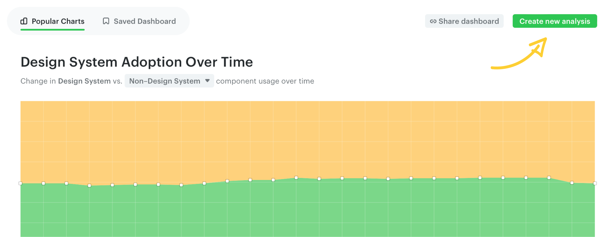
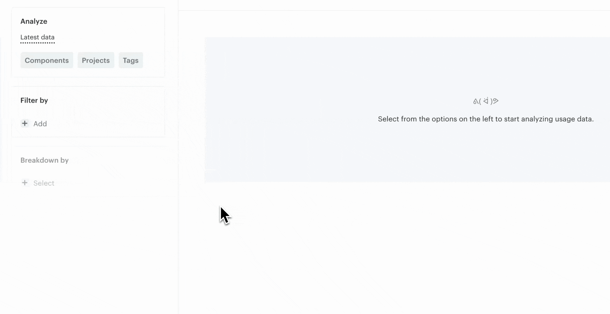
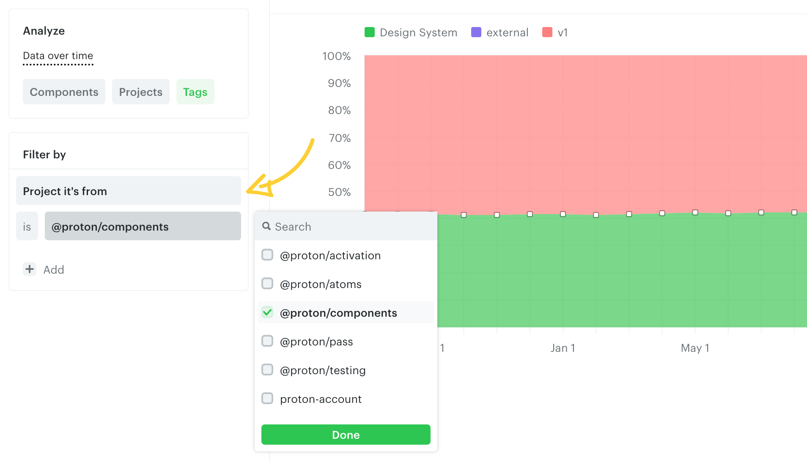
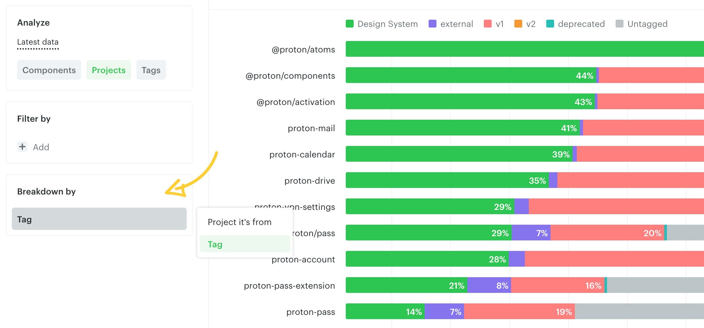

# Create custom charts

To create a custom chart, click on an existing chart from the Analytics page and modify the filters.

You can also use the **Create new analysis** button on the top right of the Analytics page to start from scratch.

You can compound the chart by **Components**, **Projects**, or **Tags**, and use either the latest data or data over time.

Use the available filters to narrow down results — e.g. create a chart based on components from specific projects.

When creating a chart with the latest data, you can break down the results by **Projects** or **Tags**.

---

← [Popular charts](./popular-charts.md) · [Save charts to dashboard](./save-charts-to-dashboard.md) →
