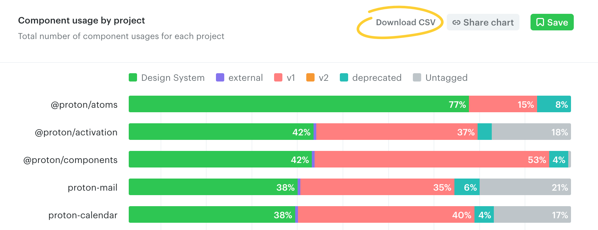

# Download chart data

Omlet provides chart data as a CSV file so you can move your analysis to a spreadsheet or another data tool.

To download a chart's data, click **Download CSV** on the top right.

---

← [Share charts and dashboards](./share-charts-and-dashboards.md)
