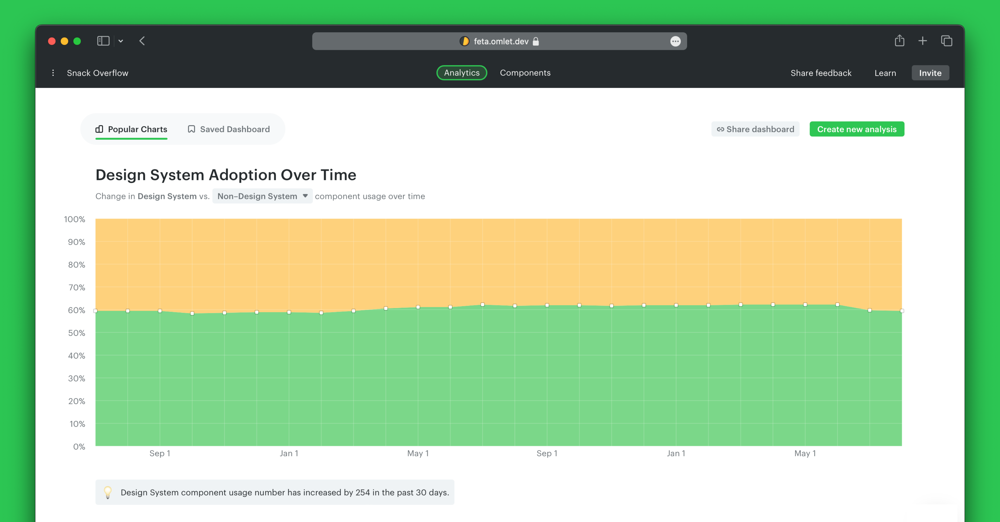
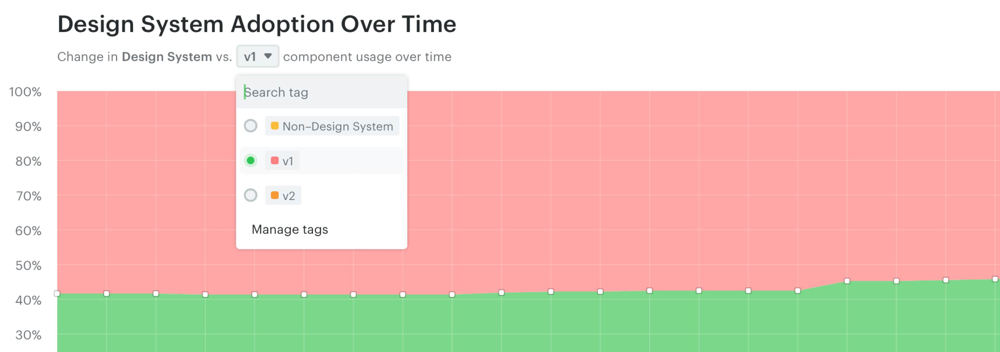
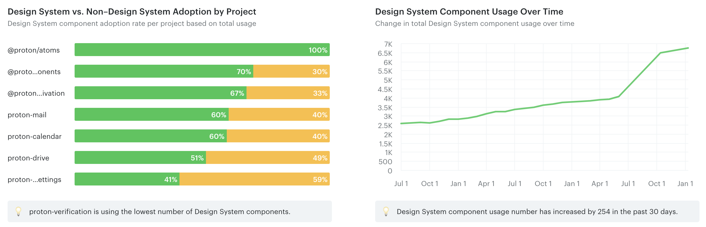
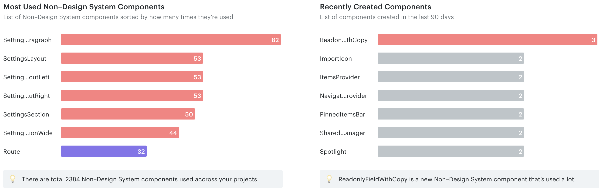
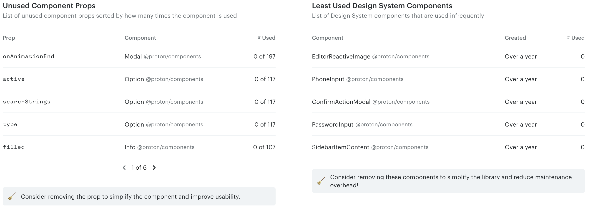

# Popular charts

Omlet provides these charts to give you a high-level overview of your design system. Most of them use the design system tag you defined during onboarding.

> **Note**
>
> Chart titles depend on the name you used for your design system tag. For example, if you defined it as "Core", you'll see titles like "Core Adoption Over Time".

## Design System Adoption Over Time

Shows the overall adoption of your design system components over time. The first time you scan your codebase, you'll only see today's data — it expands as you upload more scans with the CLI.

By default, Omlet compares the changes against non-design-system components. If you defined other tags (e.g. `v1`, `v2`), use the dropdown at the top to see adoption based on a specific tag.

> **What are non-design-system components?**
>
> Components not tagged as design system. Components from 3rd-party libraries (such as `@mui` and `@react-router-dom`) are excluded.

## How is our design system used overall?

Two charts to track design system adoption across projects and over time:

- **Design System vs. Non-Design System Adoption by Project** — a starting point to understand why one project adopts more than others.
- **Design System Component Usage Over Time** — change in total usage over time, an overview of progress and regressions.

## How can I increase design system adoption?

Identify the custom components used in production so you can make data-driven decisions about your design system:

- **Most Used Non-Design System Components** — helps you decide which components to update, deprecate, or adopt into your design system.
- **Recently Created Components** — catch unnecessary components early and identify potential improvements.

## How can I simplify the code library?

Keep your design system library lean to increase adoption, improve maintainability, and ease collaboration:

- **Unused Component Props** — props that can be removed to simplify code and reduce maintenance overhead.
- **Least Used Components** — candidates for deprecation.

---

← [Analytics](./README.md) · [Create custom charts](./create-custom-charts.md) →
