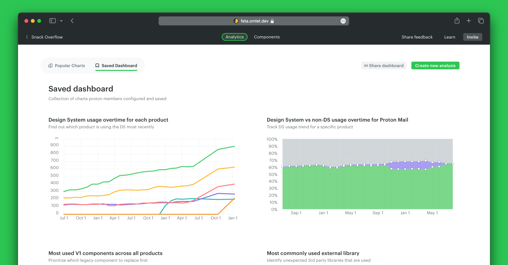
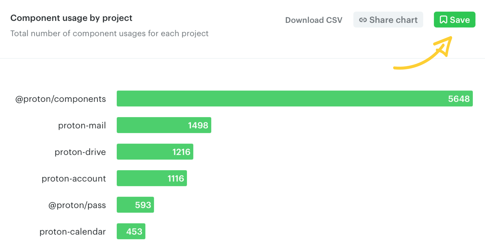
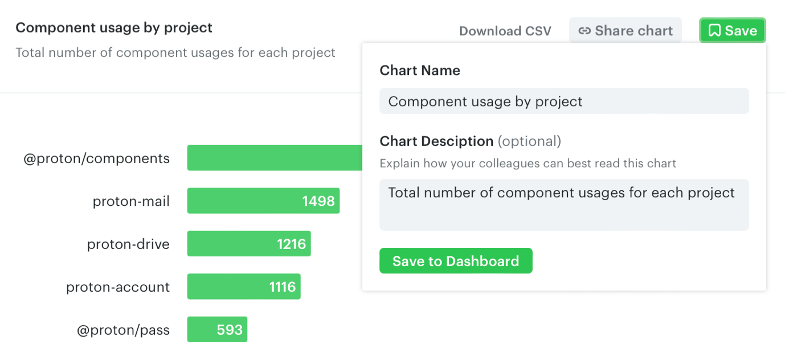
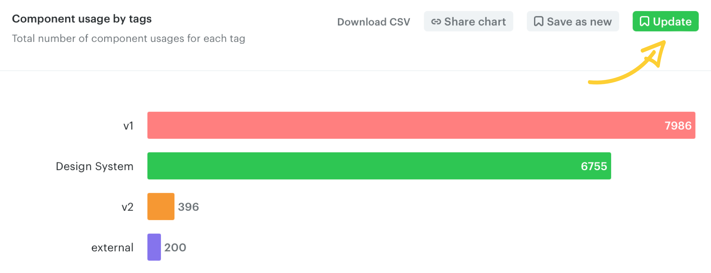
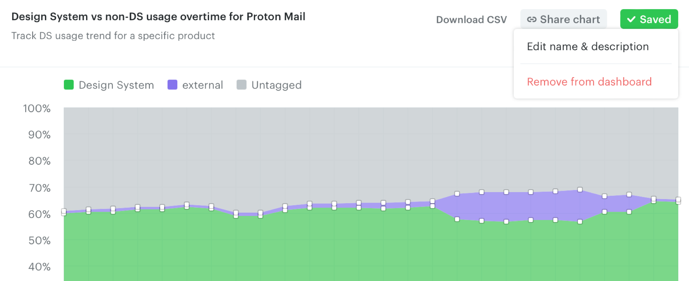
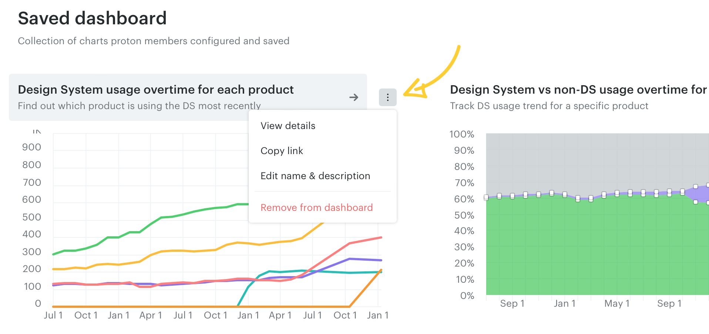

# Save charts to dashboard

The Saved Dashboard is a collection of charts you and your team configured and saved — an efficient way to track custom analyses without re-creating charts or sharing individual links.

## Saving a custom chart

Save a chart to the dashboard using the **Save** button on the top right.

Omlet suggests an autogenerated chart name and description. Update them with your preferred name and description before saving.

## Editing saved charts

Saved charts are editable. After making changes, click **Update** to save them, or **Save as new** to keep both versions.

Click the **Saved** button to edit the name and description, or remove the chart from your dashboard.

You can also use the three-dots icon to access chart options by hovering over a chart in the Saved Dashboard.

---

← [Create custom charts](./create-custom-charts.md) · [Share charts and dashboards](./share-charts-and-dashboards.md) →
