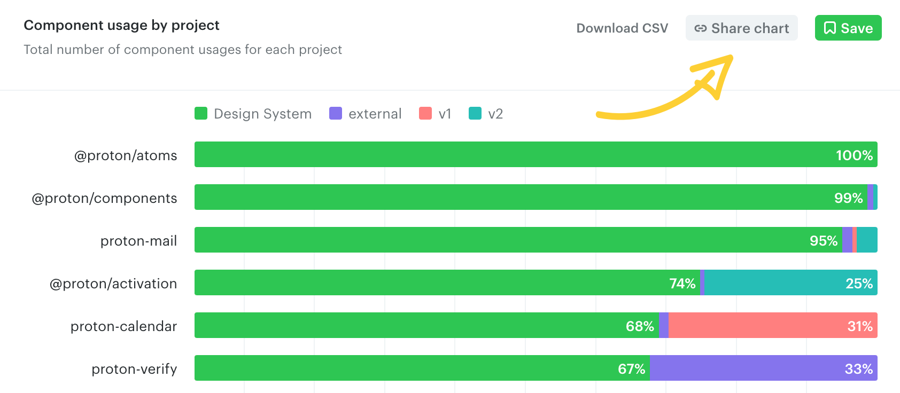
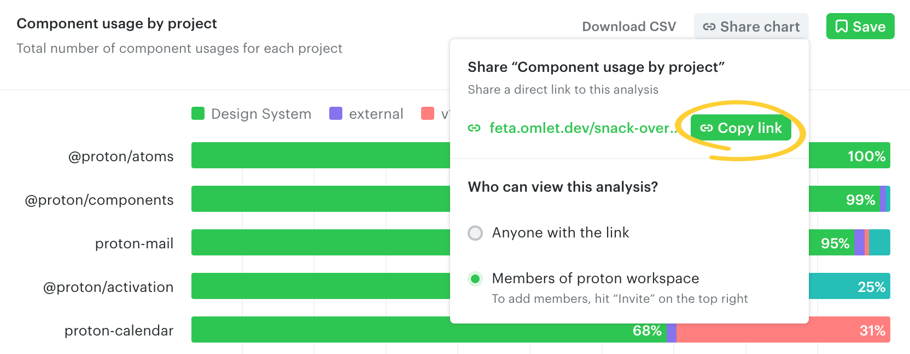
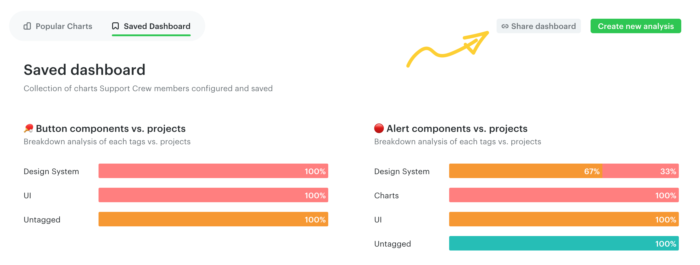
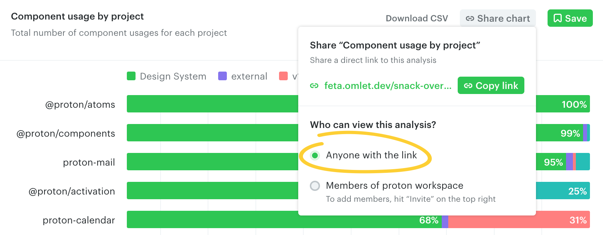

# Share charts and dashboards

## Sharing charts

To share a chart individually, click **Share chart** on the top right.

Copy the chart's link from the panel and share it with workspace members.

The link includes all the options applied to the chart, so teammates see the exact analysis you created — no need to save it to your dashboard.

## Sharing dashboards

You can also share the link to your Popular Charts and Saved Dashboard pages using the **Share dashboard** button on the top right.

## Sharing charts/dashboards publicly

You can publicly share individual charts or your Popular Charts / Saved Dashboard pages.

Change the view options to **Anyone with the link**. This updates the URL to a publicly accessible one, so teammates can view the chart or dashboard without joining your workspace.

People not in your workspace can ask to join while viewing a publicly shared chart or dashboard. You'll be notified when they do — see [Invite team members](../workspace-and-account/invite-team-members.md#invite-requests) for details.

---

← [Save charts to dashboard](./save-charts-to-dashboard.md) · [Download chart data](./download-chart-data.md) →
