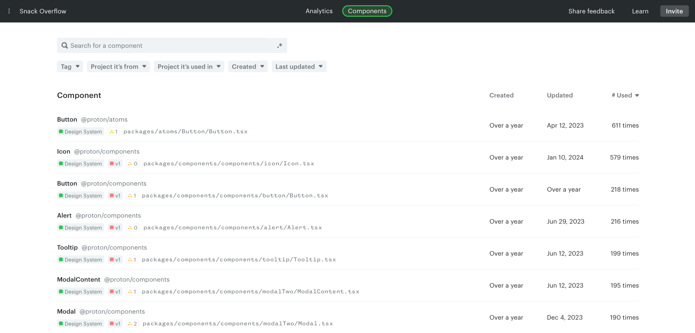

# Components

The Components page lists all your components, where you can [search and filter](./component-catalog.md) and [tag them for custom analyses](./tags.md).

You can also get deeper insights into individual components: see the [Dependency tree](./dependency-tree.md) to understand relationships, and [Props tracking](./props-tracking.md) to see how each prop is used.

## Sections

- [Search and filter components](./component-catalog.md)
- [Component tags](./tags.md)
- [Dependency tree](./dependency-tree.md)
- [Props tracking](./props-tracking.md)

---

[Component catalog](./component-catalog.md) →
