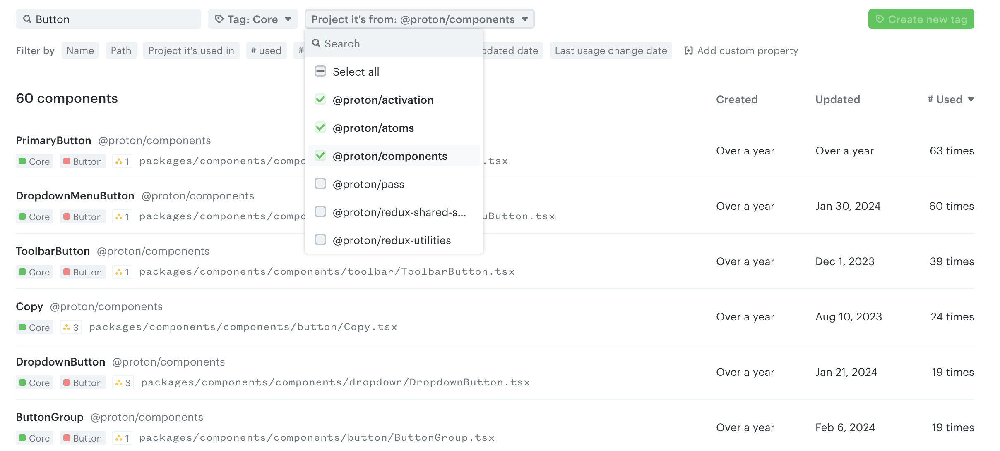
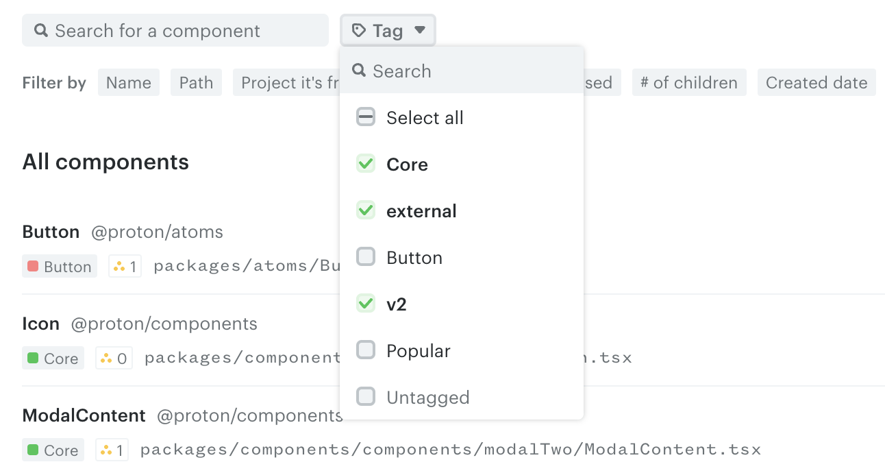
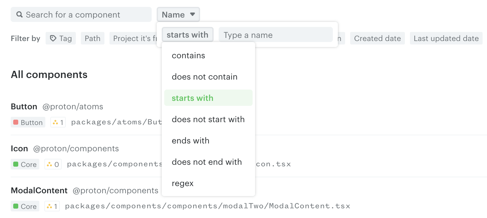
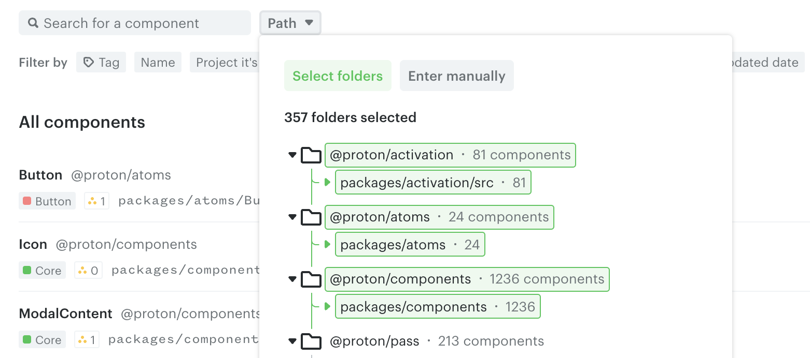
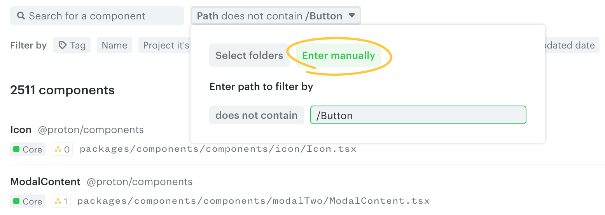
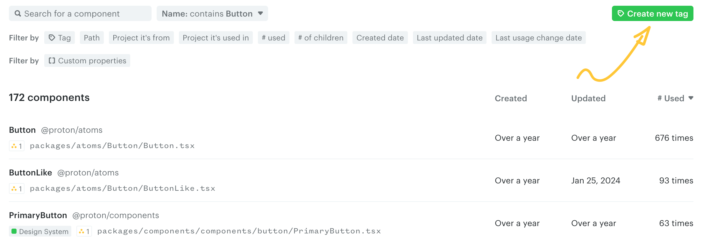
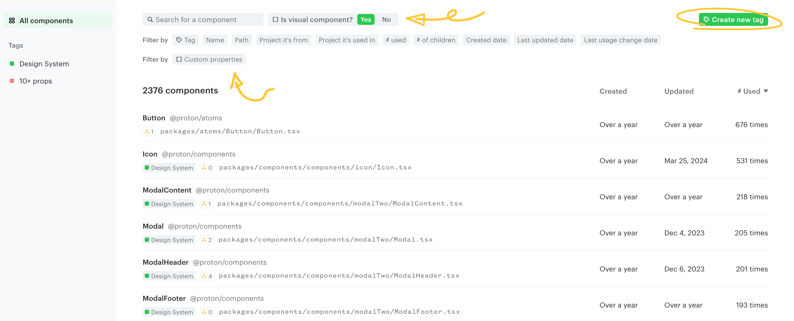
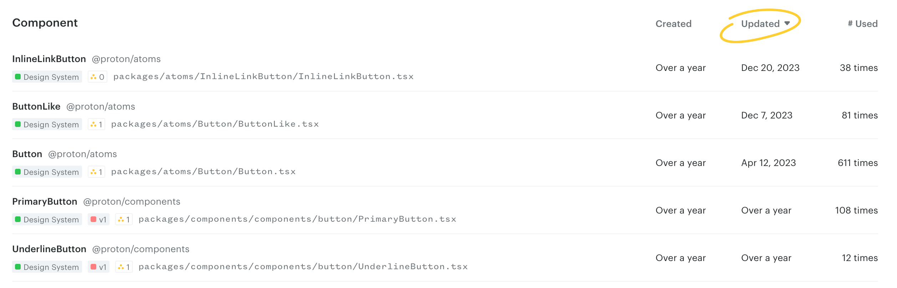

# Search and filter components

Use the search bar and/or the **Filter by** properties to narrow down the component list.

## Filter by built-in component properties

Omlet CLI collects some component properties by default while scanning your codebase, which you can use to filter and tag components.

### Tag

Filters components that have the specified tags. Selecting multiple tags returns components that have **all** of the selected tags.

> **Tip**
>
> See [Component tags](./tags.md) for how to create and manage tags.

### Name

Filters components by name using operations like `contains`, `does not contain`, or `starts with`. For more complex comparisons, use a regular expression.

### Path

Filters components by path. From the directory list (**Select folders**), you can pick multiple folders.

You can also switch to **Enter manually** to filter based on a path you type in.

### Project properties

The **Project it's from** filter lists components from the specified projects. The **Project it's used in** filter lists components used in the specified projects.

### # used

Filters components by how many times they're used across all projects. Supports `greater than`, `equals`, and `less than`.

> **Note**
>
> Project filters do not affect the value of the **# used** property. No matter which other filters are applied, **# used** is computed across all projects in the codebase.

### # of children

Filters components by how many child components they have. Supports `greater than`, `equals`, and `less than`.

### Date properties

The **Created date** and **Updated date** filters list components created or updated after the specified date, based on Git history collected by the CLI.

The **Last usage change date** filters components by the date the component's usage changed. For example, if you just started using `Button` inside `Card`, the `Button` component's "Last usage change date" updates to today.

## Create tags from filters

Once you're happy with a filtered view, tag all components in the list using the **Create new tag** button. You can then use this tag in custom charts. See [Component tags](./tags.md) for details.

## Filter by custom properties

Beyond Omlet's built-in properties, you can assign custom properties to components using [CLI hooks](../../cli/custom-component-properties/README.md). These can then be used to filter and tag components.

For example, you can add properties like:

- `Is visual component?` — whether the component is visual.
- `Owner` — the code owner from `CODEOWNERS` or any custom source.
- `Has stories` — whether Storybook stories exist.
- `Has tests` — whether tests exist.
- `Number of props` — how many props a component has.

See [Custom component properties](../../cli/custom-component-properties/README.md) for details.

## Sort the component list

You can sort the list by clicking the **Created**, **Updated**, or **# Used** headers on the top right.

---

← [Components](./README.md) · [Tags](./tags.md) →
