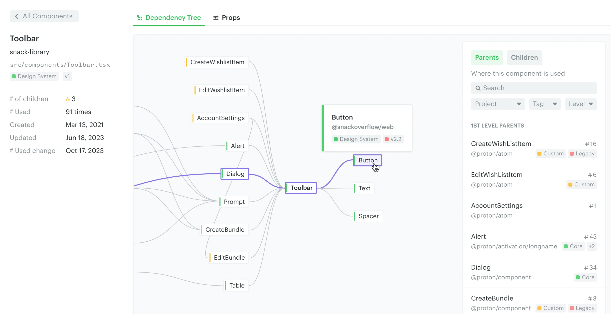
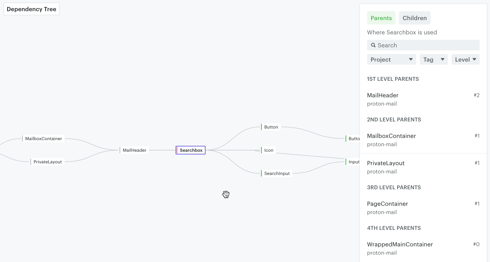
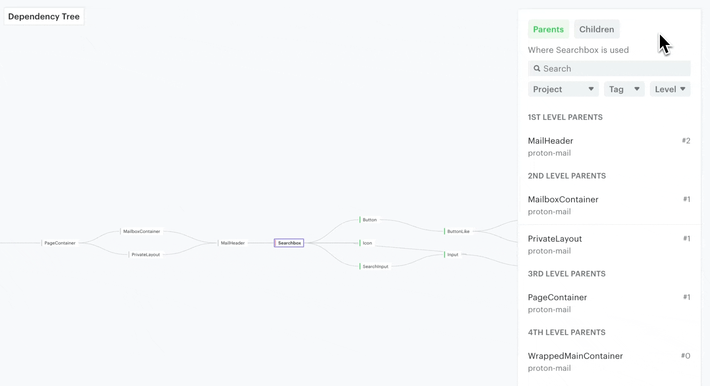

# Dependency tree

The dependency tree shows the relationships between components, so you can see what depends on what — making it easier to decide which components will be affected by a change.

## Parent vs. child components

Omlet displays where a component is used and which components it contains — its "parent" and "child" components.

Parents are on the left side of the canvas; children are on the right. In the example below, `Toolbar` uses `Button`, and `Dialog` uses `Toolbar`.

## Highlight parent/child relationships

Pan around the canvas and hover over a parent or child component to highlight the relationship.

## Filter components in the dependency tree

You can also focus on a specific parent or child by filtering. Use the components table on the right to select a component — the filter options help you find what you're looking for.

---

← [Tags](./tags.md) · [Props tracking](./props-tracking.md) →
