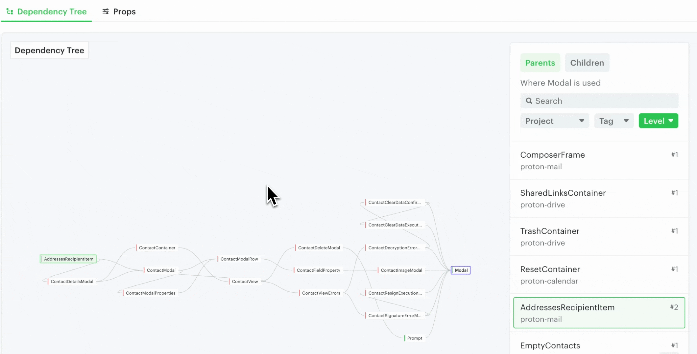
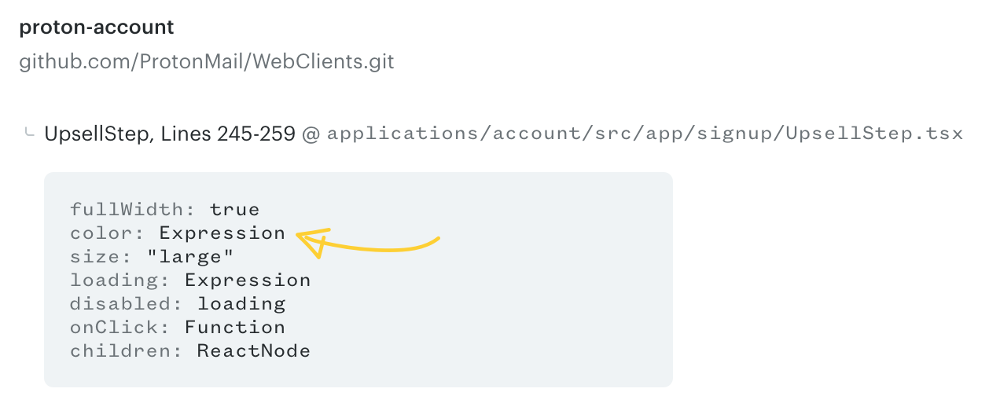
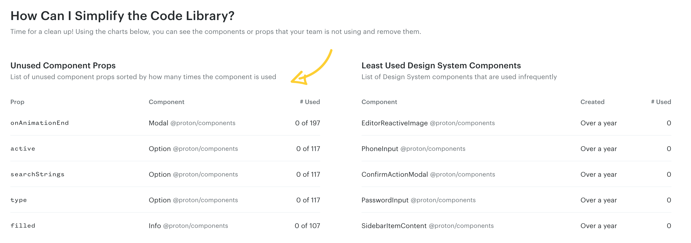

# Props tracking

Omlet tracks the usage of each prop of a component and the values being passed to those props.

This helps your team make decisions about what to add, remove, or adjust in your design system. Unused or low-usage props are good candidates to deprecate. You can also catch unusual values used in a prop to uncover unmet use cases.

## View prop usages

To list a component's props, click the **Props** tab on the **Component Detail** page. Click a prop to drill down to its values, then click **List usages** to see where and how each value is used in your codebase.

To view usage details for a specific value, click that value directly.

### `[not set]` values

`[not set]` refers to component usages where the prop value isn't specified. Open the details to see those usages.

### Dynamic values

Variables and values with non-primitive types are listed as "dynamic". You can still see where they're used in your codebase from the prop details.

## Unused component props

Under **Popular Charts**, Omlet displays unused component props that can be removed to simplify code and reduce maintenance overhead. See [Popular charts](../analytics/popular-charts.md).

---

← [Dependency tree](./dependency-tree.md)
