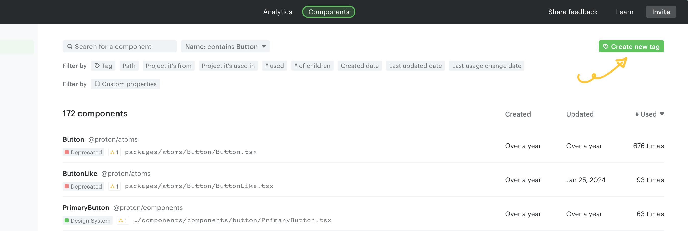
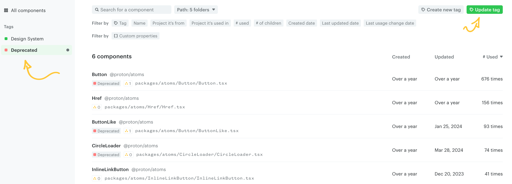
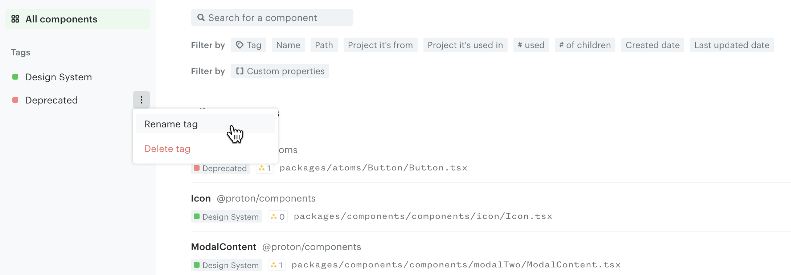
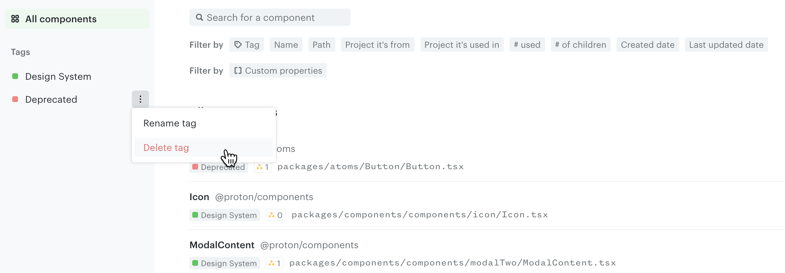

# Component tags

Tags let you label a subset of your components — based on filters — so you can search for them easily and use them in custom charts.

Common use cases:

- Track the usage decline of deprecated components
- Track usage of a legacy library you're going to deprecate
- Track multiple design system libraries individually
- Map projects or directories to product teams
- Track migration to the latest version of a component

Your workspace comes with two default tags:

- **Design system** — the tag you defined while [setting up your dashboard](../../cli/set-up-your-dashboard.md), e.g. "Core", "UI Kit", "Library". Used to analyze adoption of your design system.
- **External** — automatically applied to components from 3rd-party libraries.

> **Note**
>
> The **External** tag is generated automatically from your dependencies and isn't editable in the app. If components are tagged as external incorrectly, see [Ensure data accuracy](../../cli/ensure-data-accuracy.md).

## Create tags

### Using built-in component properties

Filter components from the catalog and click **Create new tag** in the top right.

For example, to tag all button components, use the **Name** property to filter components that contain "Button" in their name and create a tag from this filter.

There are many other properties you can filter by — see [Search and filter components](./component-catalog.md).

### Using custom properties

Custom properties added through [CLI hooks](../../cli/custom-component-properties/README.md) can also be used to filter and tag components.

Useful examples:

- `Is visual component?` — whether the component is visual.
- `Owner` — the code owner from `CODEOWNERS` or any custom source.
- `Number of props` — how many props a component has.
- `Has stories` — whether Storybook stories exist.
- `Has tests` — whether tests exist.

See [Custom component properties](../../cli/custom-component-properties/README.md).

## Update tags

### Updating filters in a tag

Select the tag from the left panel and update the filters as needed. When you're happy with the result, click **Update tag** on the right to save changes.

### Renaming a tag

Hover over a tag in the left panel, click the menu (`...`), and select **Rename tag**.

### Deleting a tag

Hover over a tag in the left panel, click the menu (`...`), and select **Delete tag**.

> **Note**
>
> Deleting a tag does not remove the components it contains. To remove components from your workspace, see [Excluding components and files](../../cli/config-file/excluding-files.md).

---

← [Component catalog](./component-catalog.md) · [Dependency tree](./dependency-tree.md) →
