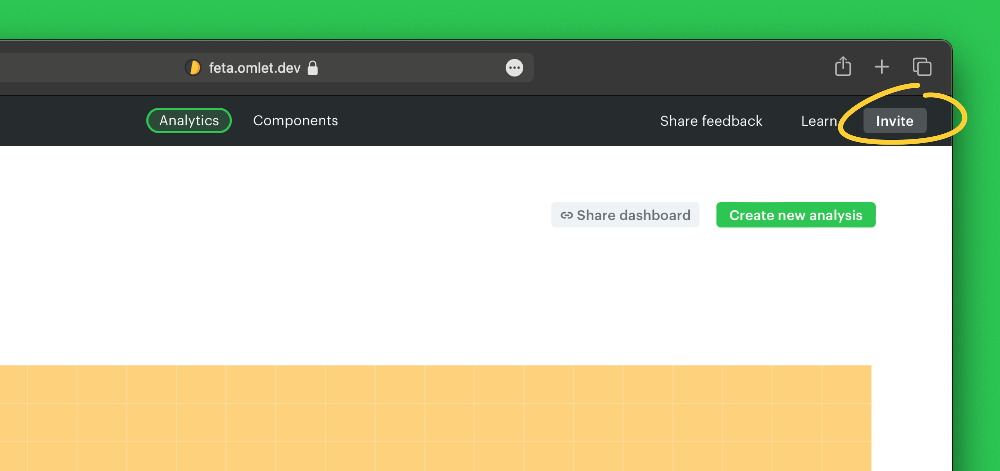
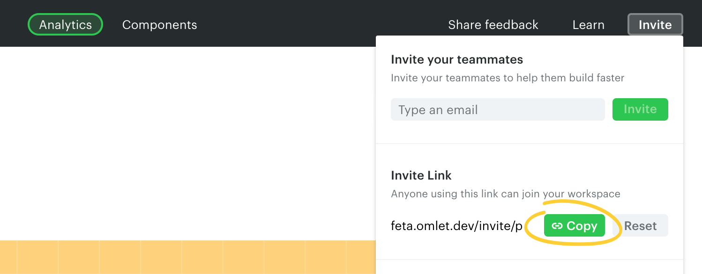
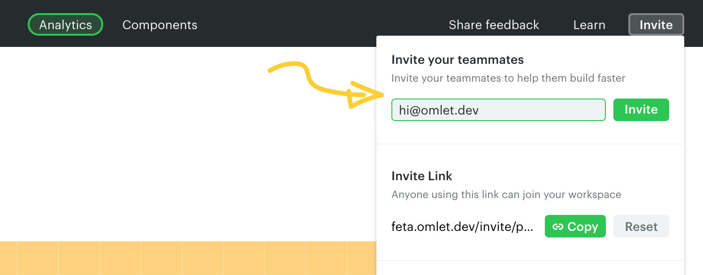
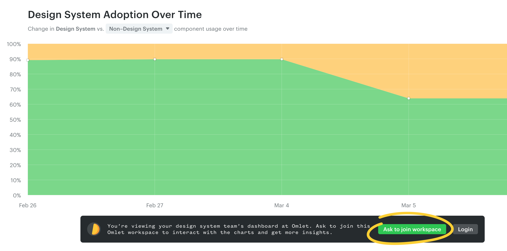
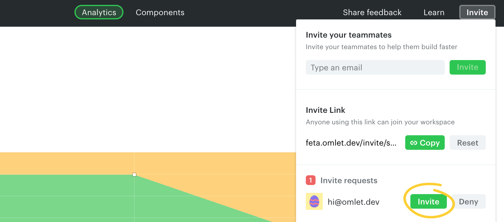

# Invite team members

Invite teammates to your workspace using the **Invite** button on the top right.

## Share an invite link

Copy an invite link and share it with your team. Anyone with the link can join the workspace — no need to send invites individually.

> **Note**
>
> The invite link doesn't expire until you reset it, and allows multiple members to join.

## Invite teammates by email

Send invites to individual team members using their email addresses. They'll receive an email to accept the invitation.

> **Note**
>
> Email invitations require email delivery to be configured in your Omlet instance. Without that, use the invite link option above.

## Invite requests

Teammates can ask to join the workspace from a [publicly accessible chart or dashboard](../analytics/share-charts-and-dashboards.md#sharing-chartsdashboards-publicly).

You'll be notified by email (if email is enabled) and can review requests using the **Invite** button on the top right.

## What workspace members can do

All members in a workspace can:

- Access the Analytics dashboard
- Explore components, their dependency trees, and prop usages
- Manage tags and add tags to components
- Create/edit custom charts and save them to the dashboard
- Invite team members to the workspace
- Share charts and dashboards publicly
- Upload scans with Omlet CLI

---

← [Workspace & account](./README.md) · [Renaming projects](./renaming-projects.md) →
