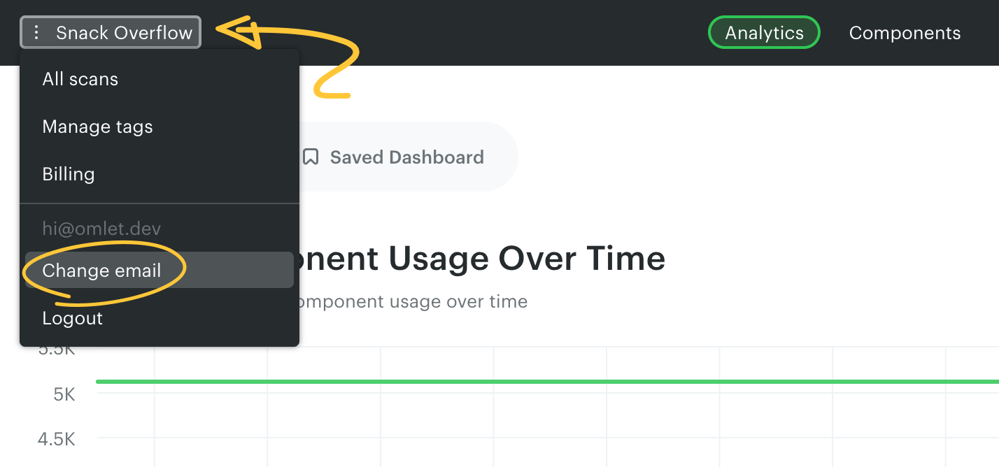
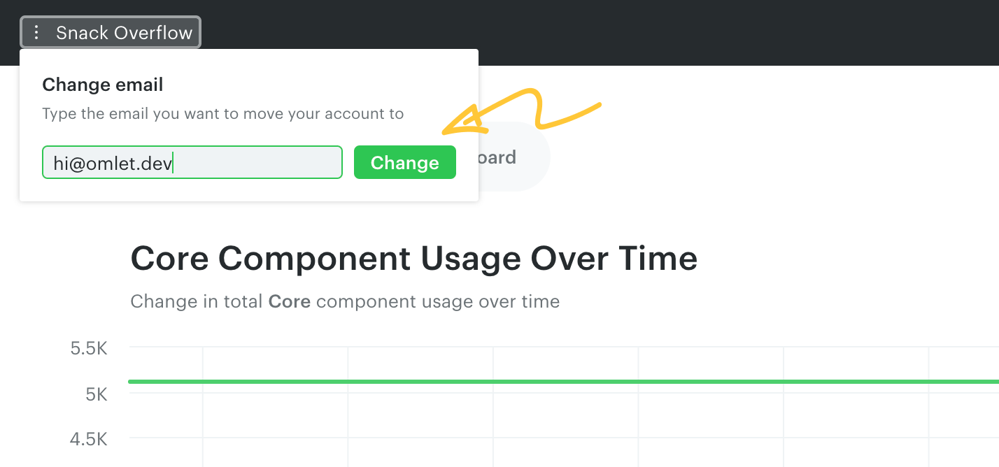

# Update your email address

To update the email address associated with your Omlet account, select **Change email** from the workspace menu on the top left.

Type the new email in the panel and click **Change**.

> **Note**
>
> You can only change your email if the new address isn't already associated with an existing Omlet account.

> **Note**
>
> Changing your email requires email delivery to be configured in your Omlet instance.

---

← [Renaming projects](./renaming-projects.md)
