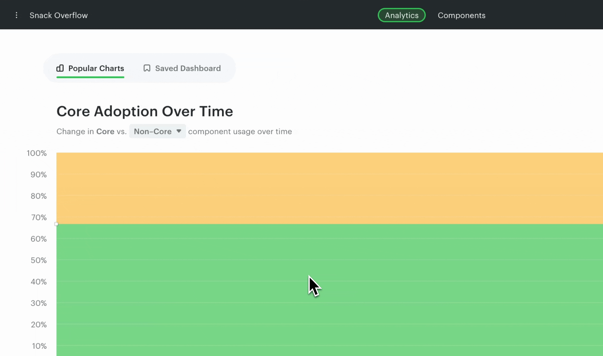

# How to delete scans

To delete a scan, navigate to the "All scans" page using the workspace menu on the top left. From there, you can delete individual scans you have made previously.

> **Note**
>
> Deleting multiple scans at once or resetting a workspace is not available yet. To reset a workspace, delete your past scans individually.

---

← [Monorepo support](./monorepo-support.md) · [Omlet vs. React Scanner](./omlet-vs-react-scanner.md) →
